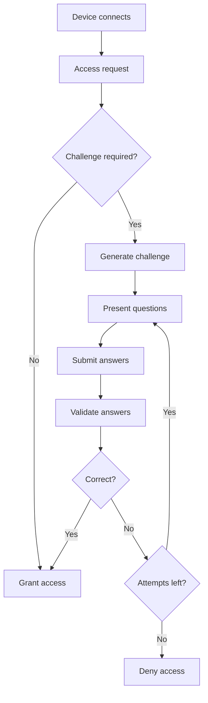

# WiFi-Kids API Documentation

A comprehensive API for GPT-5 powered parental control and learning captive portal system. This API enables educational quiz generation, answer validation, and device access management for OpenWRT routers.

## Table of Contents

- [Quick Start](#quick-start)
- [Authentication](#authentication)
- [Base URL](#base-url)
- [Core Workflow](#core-workflow)
- [API Endpoints](#api-endpoints)
  - [Health Check](#health-check)
  - [Challenge System](#challenge-system)
  - [Agent Management](#agent-management)
  - [Access Control](#access-control)
  - [Session Management](#session-management)
  - [Analytics](#analytics)
- [Data Models](#data-models)
- [Error Handling](#error-handling)
- [Configuration](#configuration)
- [Examples](#examples)

---

## Quick Start

1. **Install dependencies:**
   ```bash
   cd backend/
   pip install -e .
   ```

2. **Configure environment:**
   ```bash
   cp env.example .env
   # Edit .env with your OpenAI API key and settings
   ```

3. **Start the API server:**
   ```bash
   uvicorn api.main:app --host 0.0.0.0 --port 8000 --reload
   ```

4. **Access documentation:**
   - Interactive docs: `http://localhost:8000/docs`
   - ReDoc: `http://localhost:8000/redoc`

---

## Authentication

Currently, the API uses **IP-based access control** configured via `CORS_ORIGINS` in the environment settings. No API keys required for basic operations.

**Future Enhancement:** JWT-based authentication for admin operations.

---

## Base URL

**Development:** `http://localhost:8000`  
**Production:** `https://api.yourdomain.com`

---

## Core Workflow

The WiFi-Kids API follows this main workflow:



---

## API Endpoints

### Health Check

#### `GET /ping`
Basic health check endpoint.

**Response:**
```json
{
  "message": "pong"
}
```

---

### Challenge System

#### `POST /challenge/generate`
Generate educational challenges using AI agents.

**Request Body:**
```json
{
  "mac": "00:11:22:33:44:55",
  "router_id": "aa:bb:cc:dd:ee:ff",
  "locale": "pt-BR",
  "persona": "tutor",
  "subject": "math",
  "difficulty": "easy",
  "previous_performance": {
    "math": 0.85,
    "history": 0.70
  }
}
```

**Parameters:**
- `mac` (required): Device MAC address
- `router_id` (required): Router identifier
- `locale` (optional): Language code (default: "pt-BR")
- `persona` (optional): Agent persona - `"tutor"`, `"maternal"`, `"general"`
- `subject` (optional): Subject area - `"math"`, `"history"`, `"geography"`, `"english"`, `"physics"`, `"science"`, `"literature"`, `"art"`
- `difficulty` (optional): Difficulty level - `"easy"`, `"medium"`, `"hard"`
- `previous_performance` (optional): Historical performance scores

**Response:**
```json
{
  "challenge_id": "e50eda2e-3097-48e2-b15a-463a62f49a24",
  "questions": [
    {
      "id": "q1",
      "type": "mc",
      "prompt": "Qual é a soma de 5 + 3?",
      "options": ["6", "7", "8", "9"],
      "answer_len": null,
      "subject": "math",
      "difficulty": "easy",
      "explanation": "A soma de 5 e 3 é 8. Quando você junta 5 objetos com 3 objetos, você tem um total de 8 objetos."
    }
  ],
  "metadata": {
    "persona": "tutor",
    "subject": "math",
    "difficulty": "easy",
    "agent_type": "langchain",
    "model": "gpt-4o-mini"
  }
}
```

#### `POST /challenge/answer`
Submit answers for validation.

**Request Body:**
```json
{
  "challenge_id": "e50eda2e-3097-48e2-b15a-463a62f49a24",
  "answers": [
    {
      "id": "q1",
      "value": "8"
    }
  ]
}
```

**Success Response (Access Granted):**
```json
{
  "decision": "ALLOW",
  "allowed_minutes": 15,
  "session_id": "d6b0fe04-4be9-465c-be18-5af261a07cb5",
  "feedback": "Excellent work! You've mastered this concept."
}
```

**Failure Response (Access Denied):**
```json
{
  "decision": "DENY",
  "attempts_left": 2,
  "reason": "wrong_answer",
  "feedback": "Not quite right. Try thinking about it differently."
}
```

---

### Agent Management

#### `GET /agents/available`
Get list of available AI agents.

**Query Parameters:**
- `persona` (optional): Filter by persona type

**Response:**
```json
{
  "agents": [
    {
      "id": "tutor_openai",
      "persona": "tutor",
      "policy": "educational",
      "subjects": ["math", "science", "english"],
      "difficulty_range": ["easy", "medium", "hard"],
      "description": "Educational tutor with structured learning approach",
      "available": true
    }
  ]
}
```

#### `GET /agents/policy/{persona}`
Get policy configuration for a specific persona.

**Response:**
```json
{
  "persona": "tutor",
  "policy": {
    "max_attempts": 3,
    "score_threshold": 0.8,
    "feedback_style": "educational",
    "difficulty_progression": "adaptive",
    "subjects": ["math", "science", "english"]
  }
}
```

#### `POST /validation/test`
Test the validation system with custom inputs.

**Request Body:**
```json
{
  "question": {
    "prompt": "What is 2 + 2?",
    "options": ["3", "4", "5", "6"],
    "explanation": "Basic addition"
  },
  "student_answer": "4",
  "correct_answer": "4",
  "persona": "tutor",
  "subject": "math"
}
```

---

### Access Control

#### `POST /access-request`
Main entry point for device access requests.

**Request Body:**
```json
{
  "mac": "00:11:22:33:44:55",
  "router_id": "aa:bb:cc:dd:ee:ff",
  "client_ip": "192.168.1.100",
  "user_agent": "Mozilla/5.0..."
}
```

**Response Types:**
- **Challenge Required:** Returns challenge data
- **Access Approved:** Direct access granted
- **Access Denied:** Access denied with reason

---

### Session Management

#### `GET /session-status`
Check current session status for a device.

**Query Parameters:**
- `mac` (required): Device MAC address
- `router_id` (required): Router identifier

**Response:**
```json
{
  "active": true,
  "session_id": "d6b0fe04-4be9-465c-be18-5af261a07cb5",
  "remaining_minutes": 12,
  "expires_at": "2024-08-23T16:30:00Z"
}
```

---

### Analytics

#### `GET /analytics/students/{mac}/analytics`
Get comprehensive analytics for a student.

**Query Parameters:**
- `router_id` (required): Router identifier

**Response:**
```json
{
  "student_id": "00:11:22:33:44:55",
  "total_challenges": 15,
  "success_rate": 0.73,
  "average_score": 0.82,
  "favorite_subjects": ["math", "science"],
  "difficulty_progression": {
    "math": "medium",
    "science": "easy"
  },
  "learning_streaks": {
    "current_streak": 3,
    "longest_streak": 7
  },
  "last_activity": "2024-08-23T15:20:00Z"
}
```

#### `GET /analytics/dashboard/summary`
Get dashboard summary with key metrics.

**Response:**
```json
{
  "total_students": 45,
  "active_sessions": 12,
  "challenges_today": 89,
  "success_rate_today": 0.78,
  "top_subjects": [
    {"subject": "math", "count": 34},
    {"subject": "science", "count": 28}
  ],
  "agent_performance": [
    {"agent": "tutor_openai", "success_rate": 0.85},
    {"agent": "maternal_openai", "success_rate": 0.79}
  ]
}
```

---

## Data Models

### Question Types
- `"mc"`: Multiple choice
- `"short"`: Short answer
- `"true_false"`: True/false question

### Persona Types
- `"tutor"`: Educational tutor (structured, high standards)
- `"maternal"`: Nurturing, patient approach
- `"general"`: Balanced, gamified approach

### Subject Types
- `"math"`, `"history"`, `"geography"`, `"english"`
- `"physics"`, `"science"`, `"literature"`, `"art"`

### Difficulty Levels
- `"easy"`: Basic concepts
- `"medium"`: Intermediate level
- `"hard"`: Advanced concepts

---

## Error Handling

### HTTP Status Codes
- `200`: Success
- `400`: Bad Request (invalid parameters)
- `404`: Resource not found
- `422`: Validation Error (invalid request body)
- `500`: Internal Server Error

### Error Response Format
```json
{
  "detail": "Error message describing what went wrong"
}
```

### Common Errors
- **Invalid MAC Address:** Malformed MAC address format
- **Challenge Not Found:** Invalid or expired challenge ID
- **No Attempts Left:** Challenge attempt limit reached
- **Invalid Persona:** Unsupported persona type
- **OpenAI API Error:** LLM service unavailable

---

## Configuration

### Environment Variables

```bash
# Database
DATABASE_URL=sqlite:///./dev.db

# Session Settings
SESSION_TTL_SEC=900
CHALLENGE_REQUIRED=true
CHALLENGE_ATTEMPTS=2

# CORS
CORS_ORIGINS=https://app.wifikids.com,http://localhost:5173

# Timezone
DEFAULT_TIMEZONE=America/Sao_Paulo
ACCESS_WINDOWS=07:00-21:00

# OpenAI Configuration
OPENAI_API_KEY=your_openai_api_key_here
OPENAI_MODEL=gpt-4o-mini
OPENAI_TEMPERATURE=0.3
OPENAI_MAX_TOKENS=1000

# Agent Configuration
AGENT_TYPE=langchain
AGENT_DEFAULT_PERSONA=tutor
AGENT_SUBJECTS=math,history,geography,english,physics

# Router Configuration
ROUTER_ENABLED=true
ROUTER_PREFER_LLM=openai
ROUTER_FALLBACK_TO_MOCK=true

# Validation Configuration
VALIDATION_ENABLE_PARTIAL_CREDIT=true
VALIDATION_CASE_SENSITIVE=false
VALIDATION_IGNORE_WHITESPACE=true
VALIDATION_DEFAULT_THRESHOLD=0.75
```

---

## Examples

### Basic Challenge Flow

```python
import requests

# 1. Generate challenge
challenge_response = requests.post("http://localhost:8000/challenge/generate", json={
    "mac": "00:11:22:33:44:55",
    "router_id": "test-router",
    "persona": "tutor",
    "subject": "math",
    "difficulty": "easy"
})

challenge_data = challenge_response.json()
challenge_id = challenge_data["challenge_id"]
questions = challenge_data["questions"]

# 2. Submit answers
answer_response = requests.post("http://localhost:8000/challenge/answer", json={
    "challenge_id": challenge_id,
    "answers": [
        {"id": "q1", "value": "8"}
    ]
})

result = answer_response.json()
if result["decision"] == "ALLOW":
    print(f"Access granted for {result['allowed_minutes']} minutes!")
else:
    print(f"Access denied. {result['attempts_left']} attempts remaining.")
```

### Check Available Agents

```python
import requests

# Get all available agents
agents_response = requests.get("http://localhost:8000/agents/available")
agents = agents_response.json()["agents"]

for agent in agents:
    print(f"Agent: {agent['id']}")
    print(f"Persona: {agent['persona']}")
    print(f"Subjects: {', '.join(agent['subjects'])}")
    print("---")
```

### Monitor System Analytics

```python
import requests

# Get dashboard summary
dashboard_response = requests.get("http://localhost:8000/analytics/dashboard/summary")
summary = dashboard_response.json()

print(f"Total Students: {summary['total_students']}")
print(f"Active Sessions: {summary['active_sessions']}")
print(f"Success Rate Today: {summary['success_rate_today']:.2%}")
```

---

## Development & Testing

### Running Tests
```bash
# Run all tests
python run_tests.py --coverage

# Run specific categories
python run_tests.py --category unit
python run_tests.py --category integration
```

### API Testing
Use the interactive documentation at `/docs` for real-time API testing, or tools like Postman/cURL for automated testing.

---

## Support

- **Issues:** [GitHub Issues](https://github.com/viniciusvollrath/WiFi-Kids/issues)
- **Documentation:** [Project README](../README.md)
- **Interactive API Docs:** `/docs` endpoint when running the server

---

*This API documentation is automatically updated with each release. For the most current version, refer to the `/docs` endpoint of your running API instance.*